# Airline Management System

## Flight Operations Division

**Authors:** Aviel Oiknine and Illay Fima

## Introduction

The Airline Management System is a relational database project designed to model the main operational components of an airline company. Its purpose is to store, organize, and manage structured data related to airports, routes, aircraft, flights, terminals, and gates in a consistent and efficient way. The project follows database design principles such as normalization, integrity constraints, and clear entity relationships in order to reflect a realistic airline environment.

This project is divided into several functional divisions, with each division representing a specific area of airline operations. The part developed in this section is the **Flight Operations Division**, which focuses on the core structure of airline traffic and flight organization.

The Flight Operations Division includes the entities needed to describe how flights are operated within the system. It covers airports and the routes connecting them, the aircraft used to operate flights, and the airport infrastructure that supports passenger movement through terminals and gates. In this division, each flight is associated with a route and an aircraft, while airports are connected to terminals and terminals are connected to gates.

The main objective of this part of the project is to provide a clean, realistic, and normalized schema for flight operations. This division serves as a foundation for storing operational airline data and supports future tasks such as data insertion, querying, reporting, and integration with the other parts of the Airline Management System. 

## Table of Contents

- [Phase 1](#phase-1)
- [Phase 2](#phase-2)

# Phase 1

## ERD and DSD Diagrams

### ERD Description

This Entity-Relationship Diagram (ERD) represents the **Flight Operations Division** of the Airline Management System. It models the main operational entities involved in organizing airport activity and flight movement, including airports, routes, aircraft, flights, terminals, and gates. The purpose of this division is to describe how flights are structured, how airports are connected, how aircraft are assigned, and how airport infrastructure supports operations.

#### Entities and Attributes

##### 1. AIRPORT

The **AIRPORT** entity stores the main information about each airport managed by the system. It serves as a central entity because routes are defined between airports, and terminals belong to airports.

**Attributes:**
- `airport_id`: The unique identifier of the airport. It is the primary key used to distinguish each airport in the database.
- `iata_code`: A unique 3-letter airport code used internationally to identify airports, such as TLV, CDG, or LHR.
- `name`: The official name of the airport.
- `address`: The address or general location details of the airport.
- `city`: The city in which the airport is located.
- `region`: The region, state, or administrative area of the airport.
- `country`: The country in which the airport is located.
- `timezone`: The time zone used by the airport for scheduling and operational purposes.

##### 2. ROUTE

The **ROUTE** entity represents a flight path between two airports. A route always has one origin airport and one destination airport. It is used to define the path that a flight follows.

**Attributes:**
- `route_id`: The unique identifier of the route. It is the primary key of the entity.
- `distance_km`: The total distance of the route in kilometers.
- `estimated_duration`: The estimated travel time for the route.

##### 3. AIRCRAFT

The **AIRCRAFT** entity stores information about each aircraft that can be assigned to flights. It represents the physical airplanes used in airline operations.

**Attributes:**
- `aircraft_id`: The unique identifier of the aircraft. It is the primary key of the entity.
- `model`: The aircraft model, such as Boeing 737 or Airbus A320.
- `manufacturer`: The company that produced the aircraft.
- `capacity`: The maximum number of passengers the aircraft can carry.
- `status`: The current operational state of the aircraft, such as active, maintenance, or unavailable.

##### 4. FLIGHT

The **FLIGHT** entity represents an individual scheduled flight operated by the airline. Each flight is associated with one route and one aircraft.

**Attributes:**
- `flight_id`: The unique identifier of the flight. It is the primary key of the entity.
- `flight_number`: A unique code used to identify the flight in the airline system.
- `departure_time`: The scheduled departure date and time of the flight.
- `arrival_time`: The scheduled arrival date and time of the flight.
- `status`: The current status of the flight, such as scheduled, delayed, boarding, departed, or cancelled.

##### 5. TERMINAL

The **TERMINAL** entity represents a terminal building inside an airport. Terminals are used to organize passenger processing and gate allocation.

**Attributes:**
- `terminal_id`: The unique identifier of the terminal. It is the primary key of the entity.
- `terminal_name`: The name assigned to the terminal.
- `terminal_number`: The number or code used to identify the terminal.
- `capacity`: The maximum number of passengers the terminal can support.

##### 6. GATE

The **GATE** entity represents a boarding gate located inside a terminal. Gates are used for passenger boarding and flight departures.

**Attributes:**
- `gate_id`: The unique identifier of the gate. It is the primary key of the entity.
- `gate_number`: The gate number or code used to identify the gate.
- `status`: The operational condition of the gate, such as open, closed, or occupied.
- `max_passengers`: The maximum number of passengers that can be processed through the gate.

---

#### Relationships

##### 1. AIRPORT — TERMINAL (`has`)

This relationship shows that an airport contains terminals.

**Explanation:**
- One **AIRPORT** can have multiple **TERMINALS**.
- Each **TERMINAL** belongs to exactly one **AIRPORT**.

This relationship is important because terminals are part of airport infrastructure and cannot exist independently from an airport.

##### 2. TERMINAL — GATE (`contains`)

This relationship shows that a terminal contains gates.

**Explanation:**
- One **TERMINAL** can contain multiple **GATES**.
- Each **GATE** belongs to exactly one **TERMINAL**.

This relationship reflects the physical organization of airport infrastructure, where boarding gates are located inside terminal buildings.

##### 3. ROUTE — AIRPORT (`originates_from`)

This relationship identifies the departure airport of a route.

**Explanation:**
- Each **ROUTE** originates from exactly one **AIRPORT**.
- One **AIRPORT** can be the origin of many **ROUTES**.

This relationship is necessary to define where a route begins.

##### 4. ROUTE — AIRPORT (`arrives_at`)

This relationship identifies the arrival airport of a route.

**Explanation:**
- Each **ROUTE** arrives at exactly one **AIRPORT**.
- One **AIRPORT** can be the destination of many **ROUTES**.

This relationship is necessary to define where a route ends.

##### 5. FLIGHT — ROUTE (`follows_route`)

This relationship shows that a flight follows a predefined route.

**Explanation:**
- Each **FLIGHT** follows exactly one **ROUTE**.
- One **ROUTE** can be followed by many **FLIGHTS** over time.

This relationship allows the system to separate the concept of a route from the individual flights that use it.

##### 6. FLIGHT — AIRCRAFT (`assigned_to`)

This relationship shows that a flight is operated using a specific aircraft.

**Explanation:**
- Each **FLIGHT** is assigned to exactly one **AIRCRAFT**.
- One **AIRCRAFT** can be assigned to many **FLIGHTS** over time.

This relationship is essential because flights cannot operate without an assigned aircraft.

---

#### Summary

The ERD of the Flight Operations Division models the operational core of the airline system. The **AIRPORT** entity acts as the main hub of the model, connected to routes and terminals. **ROUTE** defines movement between airports, **FLIGHT** represents the actual scheduled operations, **AIRCRAFT** provides the resources required to operate flights, and **TERMINAL** and **GATE** represent the airport infrastructure used to support passenger flow. Together, these entities and relationships form a normalized and structured model for managing flight operations in the Airline Management System.
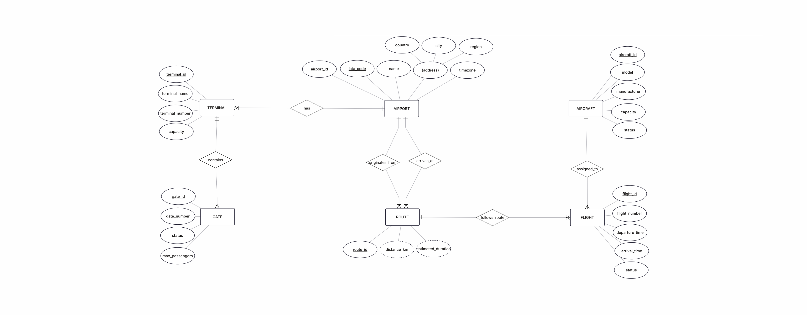  


### DSD Description

The Database Schema Diagram (DSD) shows the relational version of the Flight Operations Division. Unlike the ERD, which presents the system conceptually, the DSD translates the model into actual database tables with **primary keys**, **foreign keys**, and **uniqueness constraints**.

The main purpose of this diagram is to show how the entities are physically connected inside the database and how referential integrity is maintained between the tables.

#### Foreign Keys

The DSD includes the following foreign keys:

- `TERMINAL.airport_id (FK)` references `AIRPORT.airport_id`  
  This means that each terminal must belong to an existing airport.

- `GATE.terminal_id (FK)` references `TERMINAL.terminal_id`  
  This means that each gate must belong to an existing terminal.

- `ROUTE.origin_airport_id (FK)` references `AIRPORT.airport_id`  
  This foreign key identifies the departure airport of the route.

- `ROUTE.destination_airport_id (FK)` references `AIRPORT.airport_id`  
  This foreign key identifies the arrival airport of the route.

- `FLIGHT.route_id (FK)` references `ROUTE.route_id`  
  This means that each flight must be linked to an existing route.

- `FLIGHT.aircraft_id (FK)` references `AIRCRAFT.aircraft_id`  
  This means that each flight must be assigned to an existing aircraft.

These foreign keys are essential because they guarantee that the links between tables remain valid. For example, a flight cannot reference a route that does not exist, and a gate cannot exist without being attached to a terminal.

#### Additional Elements Shown in the DSD

In addition to foreign keys, the DSD also shows other important database-level details:

- **Primary Keys (PK):**  
  Each table contains a primary key used to uniquely identify each record.  
  Examples: `airport_id`, `route_id`, `aircraft_id`, `flight_id`, `terminal_id`, and `gate_id`.

- **Unique Constraints (U):**  
  Some attributes must contain unique values across the table.  
  In this diagram:
  - `AIRPORT.iata_code` is unique, so each airport has a different international code.
  - `FLIGHT.flight_number` is unique, so each flight has a distinct identifier.

- **Relational Structure:**  
  The DSD shows the table-to-table implementation of the system:
  - Airports are linked to terminals
  - Terminals are linked to gates
  - Routes are linked to airports
  - Flights are linked to routes and aircraft

This diagram is useful because it makes the database structure more concrete and shows exactly how the conceptual design from the ERD is implemented in relational form.
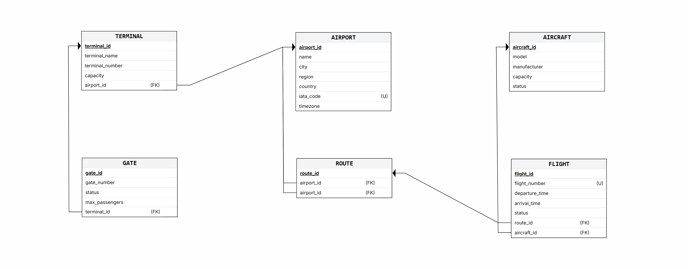

## Data Population Methods

In this phase of the project, the database was populated using three different methods in order to demonstrate multiple approaches for generating and inserting sample data into the Airline Management System. The goal of this step was not only to fill the tables with test data, but also to ensure that the generated data remained consistent with the schema constraints, including primary keys, foreign keys, uniqueness constraints, and check conditions.

The three methods used were: a Python script that generates SQL `INSERT` statements, CSV files generated with mock data tools such as Mockaroo, and SQL insert statements generated using AI tools. Each method provides a different way to create realistic test data and helps validate the database design from both a technical and practical perspective.

The following sections present each method separately.

### Method 1 – Python Script Creating Insert Statements

```python
import random
from faker import Faker
from datetime import timedelta

# Initialize Faker
fake = Faker()

# Configuration
NUM_ROWS = 100
OUTPUT_FILE = "insert_data_from_script_python.sql"

def generate_data():
    with open(OUTPUT_FILE, "w", encoding="utf-8") as f:
        f.write("-- =====================================================\n")
        f.write("-- AUTO-GENERATED INSERT STATEMENTS (100 ROWS PER TABLE)\n")
        f.write("-- =====================================================\n\n")
        f.write("BEGIN;\n\n")

        # --- 1. AIRPORT DATA ---
        f.write("-- Table: AIRPORT\n")
        airport_ids = list(range(1, NUM_ROWS + 1))
        used_iata = set()
        
        for i in airport_ids:
            name = f"{fake.city()} International Airport".replace("'", "''")
            city = fake.city().replace("'", "''")
            region = fake.state().replace("'", "''")
            country = fake.country().replace("'", "''")
            
            # Ensure unique 3-letter IATA code
            iata = fake.unique.lexify(text='???').upper()
            timezone = f"UTC{random.choice(['+','-'])}{random.randint(1,12)}"
            
            f.write(f"INSERT INTO AIRPORT (name, city, region, country, iata_code, timezone) "
                    f"VALUES ('{name}', '{city}', '{region}', '{country}', '{iata}', '{timezone}');\n")

        # --- 2. ROUTE DATA ---
        f.write("\n-- Table: ROUTE\n")
        route_ids = list(range(1, NUM_ROWS + 1))
        for i in route_ids:
            # Randomly select two different airports
            origin = random.choice(airport_ids)
            dest = random.choice([x for x in airport_ids if x != origin])
            f.write(f"INSERT INTO ROUTE (origin_airport_id, destination_airport_id) "
                    f"VALUES ({origin}, {dest});\n")

        # --- 3. AIRCRAFT DATA ---
        f.write("\n-- Table: AIRCRAFT\n")
        aircraft_brands = {
            "Boeing": ["737", "747", "777", "787"],
            "Airbus": ["A320", "A330", "A350", "A380"],
            "Embraer": ["E190", "E195"]
        }
        aircraft_ids = list(range(1, NUM_ROWS + 1))
        for i in aircraft_ids:
            brand = random.choice(list(aircraft_brands.keys()))
            model = random.choice(aircraft_brands[brand])
            capacity = random.randint(80, 450)
            status = random.choice(['Active', 'Maintenance', 'Active'])
            f.write(f"INSERT INTO AIRCRAFT (model, manufacturer, capacity, status) "
                    f"VALUES ('{model}', '{brand}', {capacity}, '{status}');\n")

        # --- 4. FLIGHT DATA ---
        f.write("\n-- Table: FLIGHT\n")
        for i in range(1, NUM_ROWS + 1):
            flight_no = f"{fake.bothify(text='??-####').upper()}"
            dep_time = fake.date_time_this_year(before_now=False, after_now=True)
            # Ensure arrival is 1 to 12 hours after departure
            arr_time = dep_time + timedelta(hours=random.randint(1, 12))
            status = random.choice(['Scheduled', 'On Time', 'Delayed'])
            route = random.choice(route_ids)
            aircraft = random.choice(aircraft_ids)
            
            f.write(f"INSERT INTO FLIGHT (flight_number, departure_time, arrival_time, status, route_id, aircraft_id) "
                    f"VALUES ('{flight_no}', '{dep_time}', '{arr_time}', '{status}', {route}, {aircraft});\n")

        # --- 5. TERMINAL DATA ---
        f.write("\n-- Table: TERMINAL\n")
        terminal_ids = list(range(1, NUM_ROWS + 1))
        for i in terminal_ids:
            t_name = f"Terminal {random.choice(['Alpha', 'Bravo', 'C', 'North', 'South'])}"
            t_num = str(random.randint(1, 6))
            cap = random.randint(2000, 15000)
            air_id = random.choice(airport_ids)
            f.write(f"INSERT INTO TERMINAL (terminal_name, terminal_number, capacity, airport_id) "
                    f"VALUES ('{t_name}', '{t_num}', {cap}, {air_id});\n")

        # --- 6. GATE DATA ---
        f.write("\n-- Table: GATE\n")
        for i in range(1, NUM_ROWS + 1):
            g_num = f"{random.choice(['A','B','G'])}{random.randint(1, 40)}"
            g_status = random.choice(['Open', 'Closed', 'Under Cleaning'])
            max_p = random.randint(100, 350)
            term_id = random.choice(terminal_ids)
            f.write(f"INSERT INTO GATE (gate_number, status, max_passengers, terminal_id) "
                    f"VALUES ('{g_num}', '{g_status}', {max_p}, {term_id});\n")

        f.write("\nCOMMIT;")
    
    print(f"File '{OUTPUT_FILE}' created successfully with {NUM_ROWS * 6} lines.")

if __name__ == "__main__":
    generate_data()
```

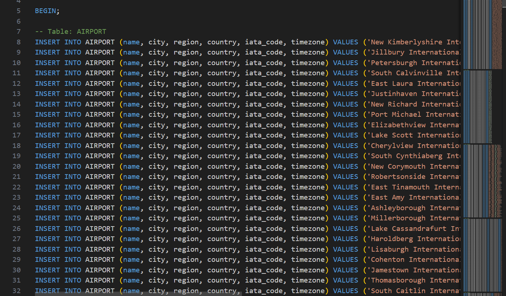

### Method 2 – Generated CSV Files from Mockaroo / GenerateData

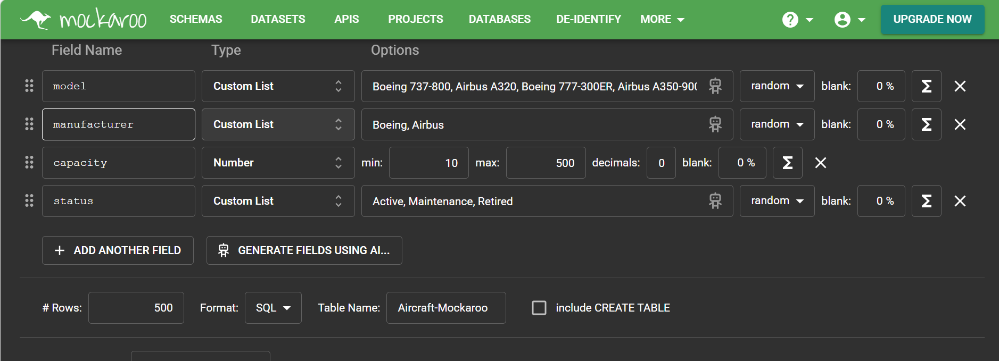

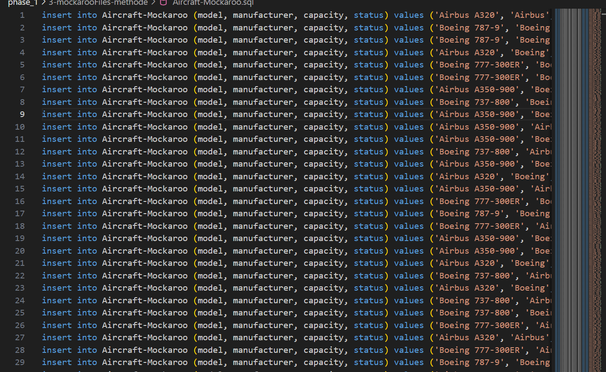

### Method 3 – AI-Generated Insert Statements

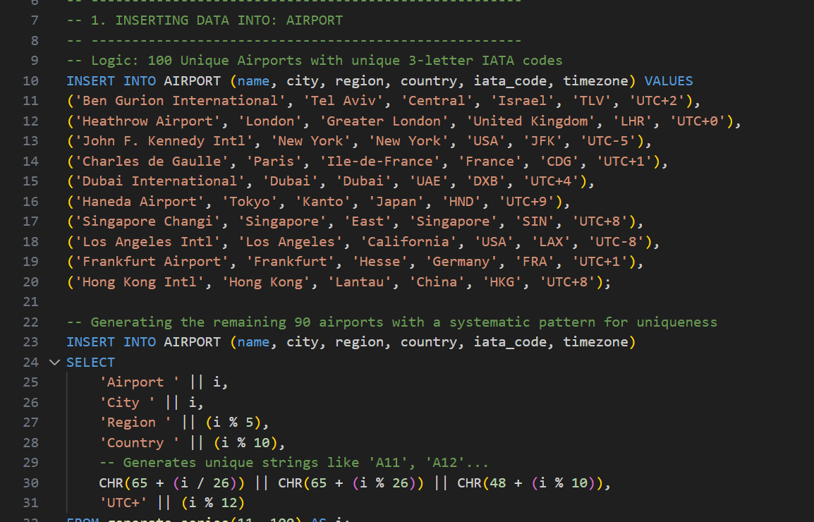


## Backup and Restore

As part of the database project, a backup and restore procedure was also performed in order to demonstrate data preservation and recovery. This step is important because it shows that the database can be saved safely and restored when needed, which is a fundamental aspect of database management.

The backup process creates a copy of the current database state, including its structure and stored data. The restore process uses that backup file to rebuild the database and recover the saved content. Together, these actions help ensure reliability, prevent accidental data loss, and support database maintenance.

The following screenshots present the execution of the backup process and the restoration of the database.

### Data Backup

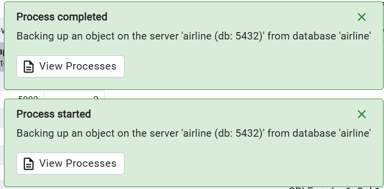

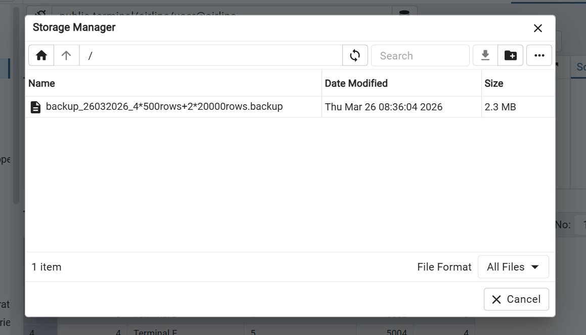

### Data Restore

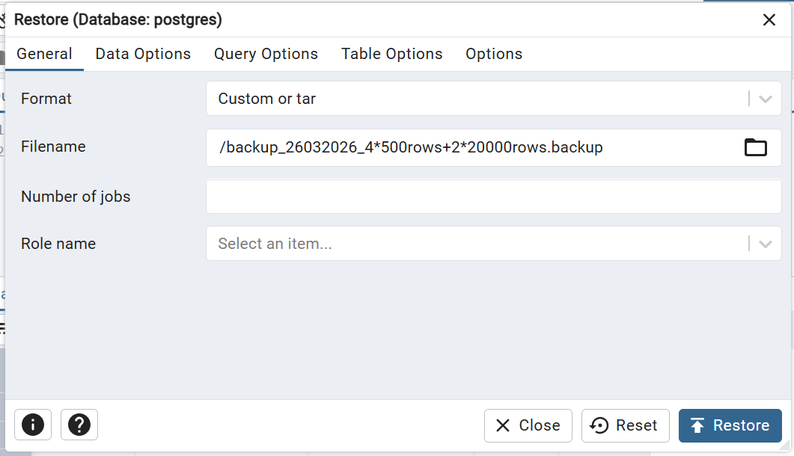

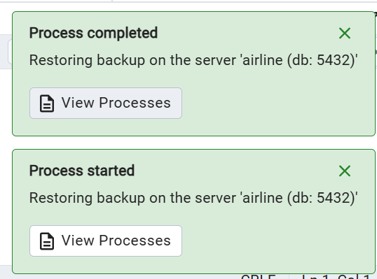


# Phase 2

## SELECT Queries

### שאילתה 1 : דו"ח עומס טיסות לפי שדה תעופה (מאי 2024)

#### Query Explanation

**הסיפור:**  
 מנהל התפעול רוצה לזהות אילו שדות תעופה הם העמוסים ביותר ביציאות במהלך חודש מאי 2024, כדי להקצות צוותי קרקע נוספים ולוודא שאין חריגה מהקיבולת.

**הסבר על ההבדל והיעילות:**  
הבדל: גרסה א' מבצעת הצלבה ישירה בין כל הטבלאות ואז מקבצת. גרסה ב' יוצרת קודם "טבלה זמנית" (Derived Table) עם הסיכומים ורק אז מחברת אותה לשמות שדות התעופה.
מה יותר יעיל? גרסה א'. ב-PostgreSQL, ה-Optimizer יודע לקחת JOIN פשוט ולהשתמש באלגוריתם שנקרא Hash Join או Merge Join בצורה אופטימלית. גרסה ב' מאלצת את בסיס הנתונים לבנות טבלה וירטואלית בזיכרון, מה שעלול להאט את הביצועים ככל שכמות הנתונים גדלה.

#### Screenshot A

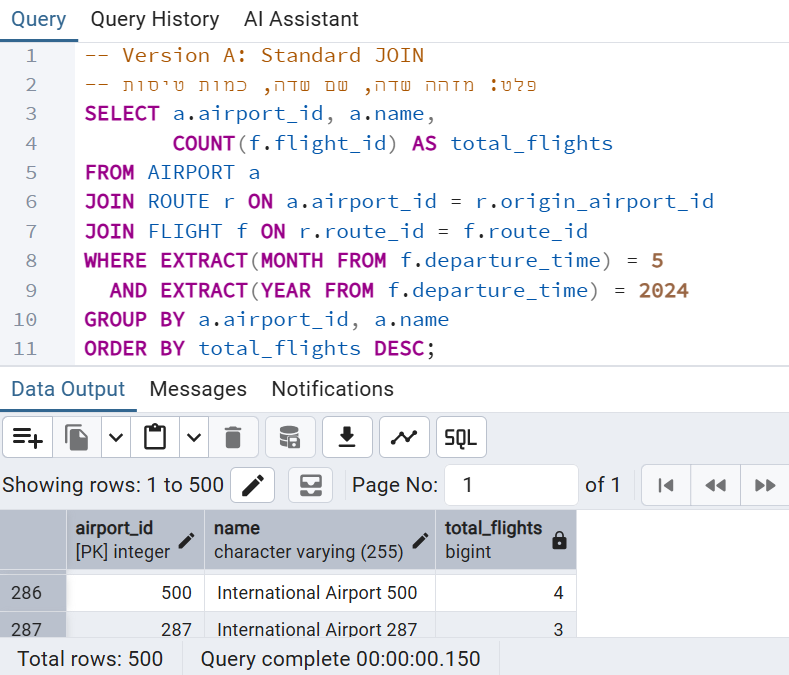

#### Screenshot B

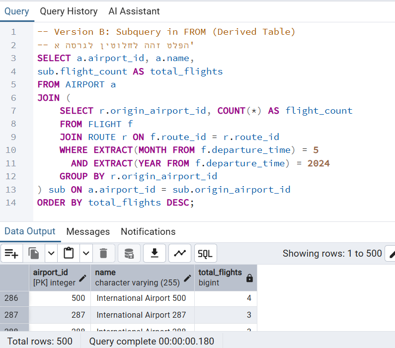

---